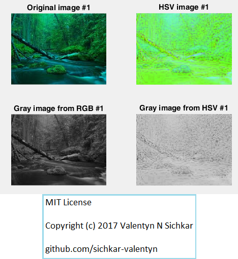
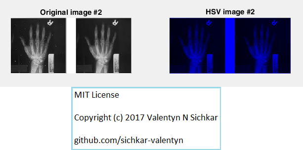
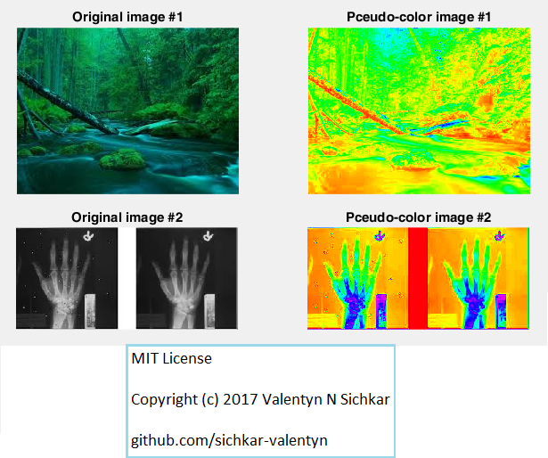
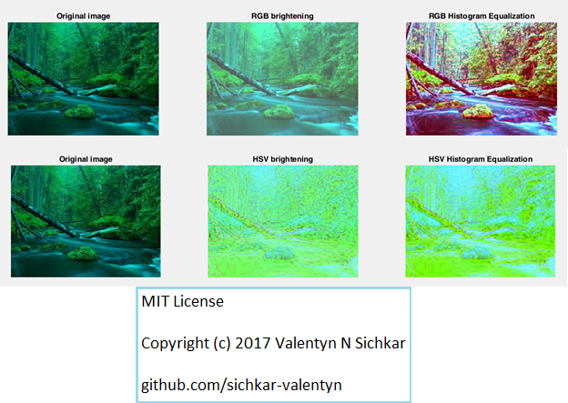
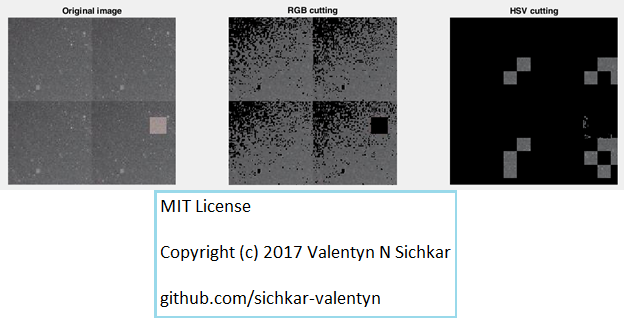

# Color Image Processing in Matlab
Pseudo-color image processing, Luminance correction, Segmentation of image in Matlab

### Reference to:
[1] Valentyn N Sichkar. Pseudo-color image processing, Luminance correction, Segmentation of image in Matlab // GitHub platform [Electronic resource]. URL: https://github.com/sichkar-valentyn/Color_Image_Processing_in_Matlab (date of access: XX.XX.XXXX)

## Description
Pseudo-color image processing, Luminance correction, Segmentation of image in Matlab

## Converting original image1 to HSV

## Converting original image2 to HSV

## Pseudo-color image processing

## Luminance correction

## Segmentation of image

## MIT License
## Copyright (c) 2017 Valentyn N Sichkar
## github.com/sichkar-valentyn
### Reference to:
[1] Valentyn N Sichkar. Pseudo-color image processing, Luminance correction, Segmentation of image in Matlab // GitHub platform [Electronic resource]. URL: https://github.com/sichkar-valentyn/Color_Image_Processing_in_Matlab (date of access: XX.XX.XXXX)
